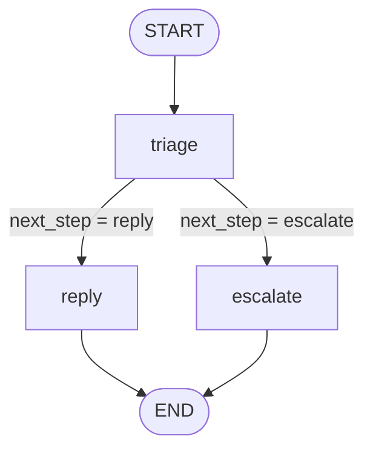

# Lab 09: LangGraph Preview

## Goal

Preview the same ticket workflow as named graph steps.

## Why Graphs

The support pipeline is linear with a small branch:

```text
load -> route -> draft -> print
```

Real support workflows often need more structure:

```text
receive ticket
  -> triage
  -> reply or escalate
  -> final response
```

At that point, a graph is easier to reason about than one long chain or deeply nested `if` statements.

## Minimal State Machine Sketch

```python
from typing import TypedDict

class TicketState(TypedDict):
    ticket_id: str
    customer: str
    channel: str
    subject: str
    message: str
    policy: str
    category: str
    severity: str
    queue: str
    next_step: str
    reason: str
    customer_reply: str
    internal_note: str
```

In the preview graph:

- state moves through named nodes
- nodes update state
- `triage` writes queue, severity, reason, and `next_step`
- conditional edges route from `next_step`
- `reply` or `escalate` drafts the final response

The optional runnable preview is:

```bash
python scripts/06_langgraph_state_machine_preview.py
```

The nodes are named after ticket-processing actions. Gemini is used inside the nodes to produce structured outputs.

## Actual Graph

The script builds this graph:

```text
START
  |
  v
triage
  |
  |-- next_step == "reply" ----> reply ----> END
  |
  |-- next_step == "escalate" -> escalate -> END
```

Same graph as Mermaid:



## Node Responsibilities

`triage`

- Reads `ticket_id`, `customer`, `channel`, `subject`, `message`, and `policy`.
- Calls Gemini with the triage prompt.
- Writes `category`, `severity`, `queue`, `next_step`, and `reason` into state.

`reply`

- Runs when `next_step` is `"reply"`.
- Calls Gemini with the standard response prompt.
- Writes `customer_reply` and `internal_note` into state.

`escalate`

- Runs when `next_step` is `"escalate"`.
- Calls Gemini with the escalation response prompt.
- Writes `customer_reply` and `internal_note` into state.

## State Movement

Initial state:

```text
ticket_id
customer
channel
subject
message
policy
```

After `triage`:

```text
category
severity
queue
next_step
reason
```

After `reply` or `escalate`:

```text
customer_reply
internal_note
```

The important difference from a normal chain is that the graph keeps a shared state object and lets the `triage` node decide which node runs next.

## Practice Lab

Run the preview script and inspect the graph-shaped ticket state.

```bash
python scripts/06_langgraph_state_machine_preview.py
```

1. Identify the state fields.
2. Identify the graph nodes.
3. Identify where Gemini writes `category`, `severity`, `queue`, and `next_step`.
4. Identify which conditional edge runs after triage.
5. Add a new field named `missing_context` to the triage schema and state.
